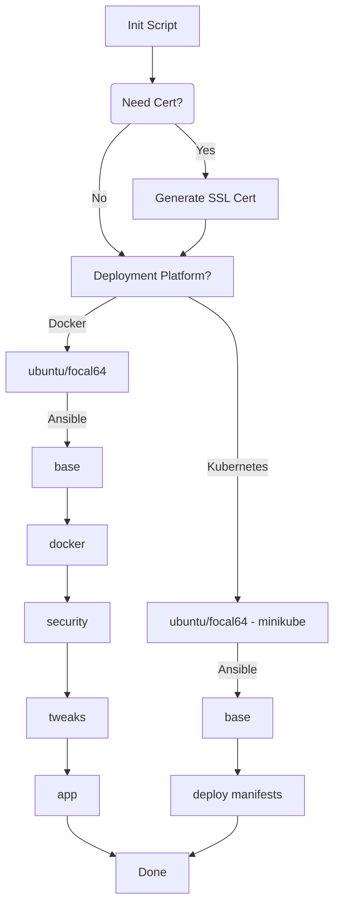

<h1 align="center">📦 Containerzied Go Application Deployment </h1>

---

<p align="center">
  <a href="#tooling">■ Tooling</a>&nbsp;&nbsp;
  <a href="#tasks">■ Tasks</a>&nbsp;&nbsp;
  <a href="#pipeline">■ Pipeline</a>&nbsp;&nbsp;
  <a href="#setup">■ Setup</a>
</p>

---

## Tooling

```
Ansible    - Configuration Management
Docker     - Containerising Application
Grafana    - Metrics Dashboard
Kubernetes - Cloud Native Container Orchestration
Prometheus - Monitoring System
Vagrant    - Setting Up Reproducible Development Environment
```

## Tasks

- [x] Containerize application
- [x] `docker-compose` setup
- - [x] Nginx SSL setup
- [x] Vagrant setup
- - [x] Bootstraping `bash` script
- [x] Ansible setup
- - [x] Configure hostname, user and timezone
- - [x] Docker installation
- - [x] Harden security
- - [x] Configure `sysctl` for IO
- - [x] Configure `sysctl` for miscellaneous parameters
- - [x] Configure `docker daemon` for defaults
- - [x] Deploy Applicaiton
- - [x] Metrics monitoring for app and redis
- [x] Kubernetes Setup
- [ ] Nomad Setup

#### Project Structure:

```
├── configs/                - Contains the configuration for various services
│   ├── ansible/            - Ansible playbook for bootstraping Vagrant boxes
│   ├── docker/             - Docker daemon config
│   ├── grafana/            - Grafana configs and dashboard
│   ├── kubernetes/         - Kubernetes configs
│   ├── nginx/              - NGINX configuration and SSL certs
│   └── prometheus/         - Prometheus configs
├── src/                    - Main application source code
│   ├── ...                 - Application files
│   ├── Dockerfile          - Instructions to build docker image
│   └── docker-compose.yaml - docker-compose file to bootstrap the application
├── init.sh                 - Shell script for bootstraping and provisioning the whole environment
├── README.md               - <-- You are here
└── Vagrantfile             - Config for Vagrant VM
```

---

## Pipeline



---

## Setup

### Init Script

`init.sh` is a Bash script that automates the deployment of an app on a Vagrant box. It includes the following main functionalities:

1. Checks whether the required Vagrant box is added and adds it if missing.
2. Verifies the presence of a Vagrantfile.
3. Generates SSL certificates if requested.
4. Prompts the user to choose a deployment platform (Docker or Kubernetes).
5. Starts the Vagrant box with the chosen platform.
6. Provides post-setup instructions.

To use the script, follow these steps:

1. Ensure you have Vagrant and VirtualBox (or a similar provider) installed.
2. Run the script and follow the prompts to configure SSL certificates and choose a deployment platform.

### Containerization

We are using Docker For building and containerizing our application, while Docker Compose is utilized to orchestrate the application and related services.

#### Dockerfile:

The Dockerfile has two stages:

1. Build Stage:
   - Uses the golang:1.13.15-alpine3.12 image.
   - Downloads Go module dependencies, installs required tools, and builds the application.
2. Runtime Stage:
   - Uses the alpine:3.12 image.
   - Sets a maintainer label and a non-root user.
   - Copies the built application binary and sets it as the entry point.

#### docker-compose.yaml

The Docker Compose configuration sets up a complete stack for a web application, including a reverse proxy (Nginx), a Redis cache, monitoring tools (Prometheus and Grafana), and a Redis Metrics Exporter. It ensures that services are restarted if they fail and defines dependencies between them for proper initialization.

1. Services:
   - app: This service builds an application using the current directory as the build context. It depends on a Redis service, and it sets environment variables to configure its connection to Redis.
   - nginx: Uses the official Nginx Alpine image, exposes ports 80 and 443, and mounts Nginx configuration files from the host.
   - redis: Utilizes the official Redis Alpine image, runs the Redis server with specific configurations, and stores data in a volume named "cache."
   - redis-exporter: Runs a Redis exporter container to expose Redis metrics on port 9121, with a dependency on the Redis service.
   - prometheus: Uses the Prometheus image, exposing port 9090 and mounting a Prometheus configuration file from the host.
   - grafana: Runs Grafana on port 3000, mounting volumes for data sources, dashboards, and configuration, with a dependency on Prometheus.

2. Volumes:
   - Defines a named volume called "cache" used by the Redis service to store data.

### Vagrant

The Vagrantfile is the configuration script used to define the virtual machine setup for a development environment using Virtualbox and bootstrap it. It has the following key characteristics:

1. It checks the value of the `PLATFORM` environment variable to determine whether the target platform is Kubernetes or not. If it is set to "kubernetes," it uses the `ilionx/ubuntu2004-minikube` box; otherwise, it uses the `ubuntu/focal64` box.

2. It doesn't allows insecure box downloads, which means it cannot download boxes without using secure connections.

3. It disables the graphical user interface (GUI).

4. If the target platform is not Kubernetes (`IS_KUBERNETES` is false), it forwards the following ports from the guest VM to the host machine:

   - Port 80 (guest) to 8080 (host)
   - Port 443 (guest) to 4430 (host)
   - Port 9090 (guest) to 9090 (host)
   - Port 3000 (guest) to 3000 (host)

5. It provisions the virtual machine using Ansible:
   - It sets Ansible verbosity to a high level with `ansible.verbose = "vv"`.
   - It specifies the Ansible playbook to be executed, which is located at "configs/ansible/playbook.yaml."
   - It provides extra variables to the Ansible playbook, including the "PLATFORM" variable obtained from the environment.

### Playbook

This Ansible playbook is designed to configure a system with various roles based on the specified platform. It applies different roles conditionally depending on the platform. Roles include "base," "docker," "security," "tweaks," "app," and "kubernetes." The playbook uses become to execute tasks with elevated privileges.

#### Roles

<details>
  <summary>app</summary>
1. Copies application files to /etc/demo-ops directory with a specified owner and permissions.<br>
2. Copies Nginx configuration files to /etc/configs/nginx with the same owner and permissions.<br>
3. Copies Prometheus configuration files to /etc/configs/prometheus with the same owner and permissions.<br>
4. Copies Grafana configuration files to /etc/configs/grafana with the same owner and permissions.<br>
5. Runs the application by executing a Docker Compose command in the /etc/demo-ops directory.
</details>
<details>
  <summary>base</summary>
1. Adds a user with specified properties, handling errors if the user already exists.<br>
2. Adds the current user to the sudo group, handling errors if the user is already in the group.<br>
3. Sets the hostname, ignoring errors if the hostname is invalid.<br>
4. Sets the timezone, ignoring errors if the timezone is invalid.<br>
5. Updates packages using the apt package manager, handling errors if the update fails.<br>
</details>
<details>
  <summary>docker</summary>
1. Remove old and unofficial Docker packages (if any).<br>
2. Install Docker dependencies.<br>
3. Add the Docker GPG key for package verification.<br>
4. Set up the Docker repository.<br>
5. Install Docker itself.<br>
6. Add specified users to the Docker group.<br>
7. Configure the Docker daemon by copying a configuration file.<br>
</details>
<details>
  <summary>kubernetes</summary>
    1. Copy Kubernetes manifests from a source directory to /etc/demo-ops, ensuring they are owned by a specified user and have appropriate permissions (0644).<br>
    2. Apply a Kubernetes namespace configuration (namespace.yaml) using the kubectl apply command.<br>
    3. Apply a Redis configuration (redis.yaml) using the kubectl apply command.<br>
    4. Apply an application configuration (app.yaml) using the kubectl apply command.<br>
</details>
<details>
  <summary>security</summary>
    1. Disables root login in SSH configuration.<br>
    2. Installs the Uncomplicated Firewall (ufw) package.<br>
    3. Denies all incoming connections by default.<br>
    4. Allows incoming SSH connections on port 22.<br>
    5. Allows incoming HTTP connections on port 80.<br>
    6. Allows incoming HTTPS connections on port 443.<br>
    7. Enables the firewall.<br>
</details>
<details>
  <summary>tweaks</summary>
    1. I/O Tweaks:<br>
    1a.<code>fs.file-max</code><br>
    This parameter determines the maximum number of file handles that the Linux kernel allows a process to allocate. File handles are used to access files and other resources. In a production server environment, there may be many processes and connections that need file handles. Setting this value to a high number ensures that the server can handle a large number of open files simultaneously, which is important for serving many clients or managing a large number of files efficiently.<br><br>
    1b.<code>vm.swappiness</code><br>
    This parameter controls the tendency of the Linux kernel to swap out memory pages to disk when the system is under memory pressure. Swapping is the process of moving data from RAM to disk to free up RAM for other processes. Setting a lower value (such as 1-10) reduces the likelihood of swapping and helps ensure that the server's performance remains stable even when memory usage is high. For a production server, you typically want to minimize swapping to maintain responsiveness.<br><br>
    <br>
    2. I/O Tweaks:<br>
    2a.<code>vm.dirty_ratio</code><br>
    This parameter sets the percentage of system memory that can be filled with "dirty" data (data that has been modified but not yet written to disk) before the system starts writing it to disk. A higher value allows more data to be cached in memory before writing to disk, which can improve I/O performance. However, setting it too high may increase the risk of data loss in the event of a system crash.<br><br>
    2b.<code>vm.dirty_expire_centisecs</code><br>
    This parameter determines how long dirty data can remain in memory (in centiseconds) before it is considered old and needs to be written to disk. Setting an appropriate value helps balance between maintaining good system performance and ensuring that dirty data is eventually flushed to disk to prevent data loss in case of a crash. 6000 in our case, which equates to 60 seconds.<br><br>
    2c.<code>fs.protected_hardlinks</code><br>
    This parameter is a security feature that prevents hard links to files with immutable or append-only attributes. Hard links are a way to create multiple directory entries pointing to the same inode (file data). Enabling this feature helps protect against certain types of attacks that could manipulate or modify critical system files. This is important for security on a production server.<br><br>
    2d.<code>fs.protected_symlinks</code><br>
    Similar to fs.protected_hardlinks, this parameter is a security feature that prevents symbolic links (symlinks) from targeting files with immutable or append-only attributes. Enabling this feature adds an extra layer of security by preventing malicious symlinks from affecting protected files. This is important for maintaining the integrity of system files and preventing unauthorized changes.<br><br>
</details>

---

<h4 align="center">End 👋</h4>